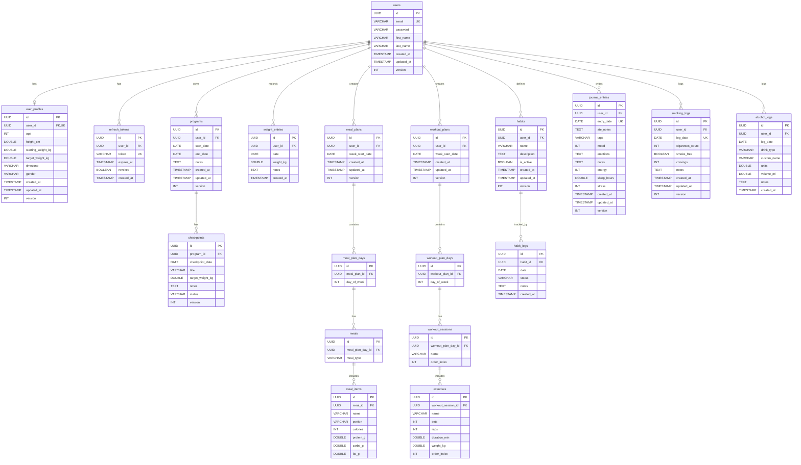

# Optiva ER Diagram

```mermaid
erDiagram
    users {
        UUID id PK
        VARCHAR email UK
        VARCHAR password
        VARCHAR first_name
        VARCHAR last_name
        TIMESTAMP created_at
        TIMESTAMP updated_at
        INT version
    }

    user_profiles {
        UUID id PK
        UUID user_id FK,UK
        INT age
        DOUBLE height_cm
        DOUBLE starting_weight_kg
        DOUBLE target_weight_kg
        VARCHAR timezone
        VARCHAR gender
        TIMESTAMP created_at
        TIMESTAMP updated_at
        INT version
    }

    refresh_tokens {
        UUID id PK
        UUID user_id FK
        VARCHAR token UK
        TIMESTAMP expires_at
        BOOLEAN revoked
        TIMESTAMP created_at
    }

    programs {
        UUID id PK
        UUID user_id FK
        DATE start_date
        DATE end_date
        TEXT notes
        TIMESTAMP created_at
        TIMESTAMP updated_at
        INT version
    }

    checkpoints {
        UUID id PK
        UUID program_id FK
        DATE checkpoint_date
        VARCHAR title
        DOUBLE target_weight_kg
        TEXT notes
        VARCHAR status
        INT version
    }

    weight_entries {
        UUID id PK
        UUID user_id FK
        DATE date
        DOUBLE weight_kg
        TEXT notes
        TIMESTAMP created_at
    }

    meal_plans {
        UUID id PK
        UUID user_id FK
        DATE week_start_date
        TIMESTAMP created_at
        TIMESTAMP updated_at
        INT version
    }

    meal_plan_days {
        UUID id PK
        UUID meal_plan_id FK
        INT day_of_week
    }

    meals {
        UUID id PK
        UUID meal_plan_day_id FK
        VARCHAR meal_type
    }

    meal_items {
        UUID id PK
        UUID meal_id FK
        VARCHAR name
        VARCHAR portion
        INT calories
        DOUBLE protein_g
        DOUBLE carbs_g
        DOUBLE fat_g
    }

    workout_plans {
        UUID id PK
        UUID user_id FK
        DATE week_start_date
        TIMESTAMP created_at
        TIMESTAMP updated_at
        INT version
    }

    workout_plan_days {
        UUID id PK
        UUID workout_plan_id FK
        INT day_of_week
    }

    workout_sessions {
        UUID id PK
        UUID workout_plan_day_id FK
        VARCHAR name
        INT order_index
    }

    exercises {
        UUID id PK
        UUID workout_session_id FK
        VARCHAR name
        INT sets
        INT reps
        DOUBLE duration_min
        DOUBLE weight_kg
        INT order_index
    }

    habits {
        UUID id PK
        UUID user_id FK
        VARCHAR name
        TEXT description
        BOOLEAN is_active
        TIMESTAMP created_at
        TIMESTAMP updated_at
        INT version
    }

    habit_logs {
        UUID id PK
        UUID habit_id FK
        DATE date
        VARCHAR status
        TEXT notes
        TIMESTAMP created_at
    }

    journal_entries {
        UUID id PK
        UUID user_id FK
        DATE entry_date UK
        TEXT ate_notes
        VARCHAR tags
        INT mood
        TEXT emotions
        TEXT notes
        INT energy
        DOUBLE sleep_hours
        INT stress
        TIMESTAMP created_at
        TIMESTAMP updated_at
        INT version
    }

    smoking_logs {
        UUID id PK
        UUID user_id FK
        DATE log_date UK
        INT cigarettes_count
        BOOLEAN smoke_free
        INT cravings
        TEXT notes
        TIMESTAMP created_at
        TIMESTAMP updated_at
        INT version
    }

    alcohol_logs {
        UUID id PK
        UUID user_id FK
        DATE log_date
        VARCHAR drink_type
        VARCHAR custom_name
        DOUBLE units
        DOUBLE volume_ml
        TEXT notes
        TIMESTAMP created_at
    }

    users ||--o| user_profiles : "has"
    users ||--o{ refresh_tokens : "has"
    users ||--o{ programs : "owns"
    users ||--o{ weight_entries : "records"
    users ||--o{ meal_plans : "creates"
    users ||--o{ workout_plans : "creates"
    users ||--o{ habits : "defines"
    users ||--o{ journal_entries : "writes"
    users ||--o{ smoking_logs : "logs"
    users ||--o{ alcohol_logs : "logs"

    programs ||--o{ checkpoints : "has"

    meal_plans ||--o{ meal_plan_days : "contains"
    meal_plan_days ||--o{ meals : "has"
    meals ||--o{ meal_items : "includes"

    workout_plans ||--o{ workout_plan_days : "contains"
    workout_plan_days ||--o{ workout_sessions : "has"
    workout_sessions ||--o{ exercises : "includes"

    habits ||--o{ habit_logs : "tracked_by"
```
